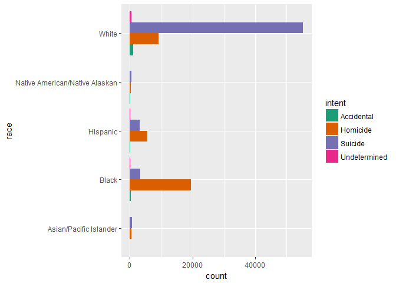
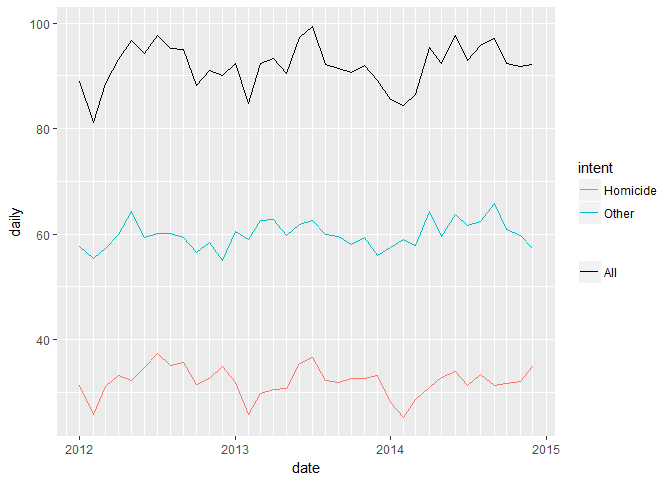

### Gun Deaths in America 2012-2014  
by Jeremy Tran, May 28, 2018  

*****

So since the 2nd Amendment seems like a rather hot topic at the moment, and is also of interest to me considering my former work when I used to converse with veterans of various political inclinations, I decided to explore a data set regarding gun violence. I used the one curated by FiveThirtyEight, [Deaths in the US|Kaggle](https://www.kaggle.com/hakabuk/gun-deaths-in-the-us).  

Instead of using Python as one of the authors did, I used R to see if I could glean the same or different conclusions and predictions, and also test my rudimentary R knowledge (albeit from 12 years ago).


```
## [1] 100798     11
```


```
##        X               year          month                 intent     
##  Min.   :     1   Min.   :2012   Min.   : 1.000   Accidental  : 1639  
##  1st Qu.: 25200   1st Qu.:2012   1st Qu.: 4.000   Homicide    :35176  
##  Median : 50400   Median :2013   Median : 7.000   Suicide     :63175  
##  Mean   : 50400   Mean   :2013   Mean   : 6.568   Undetermined:  807  
##  3rd Qu.: 75599   3rd Qu.:2014   3rd Qu.: 9.000   NA's        :    1  
##  Max.   :100798   Max.   :2014   Max.   :12.000                       
##                                                                       
##      police        sex            age        
##  Min.   :0.00000   F:14449   Min.   :  0.00  
##  1st Qu.:0.00000   M:86349   1st Qu.: 27.00  
##  Median :0.00000             Median : 42.00  
##  Mean   :0.01391             Mean   : 43.86  
##  3rd Qu.:0.00000             3rd Qu.: 58.00  
##  Max.   :1.00000             Max.   :107.00  
##                              NA's   :18      
##                              race          hispanic    
##  Asian/Pacific Islander        : 1326   Min.   :100.0  
##  Black                         :23296   1st Qu.:100.0  
##  Hispanic                      : 9022   Median :100.0  
##  Native American/Native Alaskan:  917   Mean   :114.2  
##  White                         :66237   3rd Qu.:100.0  
##                                         Max.   :998.0  
##                                                        
##                 place         education    
##  Home              :60486   Min.   :1.000  
##  Other specified   :13751   1st Qu.:2.000  
##  Street            :11151   Median :2.000  
##  Other unspecified : 8867   Mean   :2.296  
##  Trade/service area: 3439   3rd Qu.:3.000  
##  (Other)           : 1720   Max.   :5.000  
##  NA's              : 1384   NA's   :53
```

So this dataset was already cleaned by FiveThirtyEight and can be considered tidy.  
Source: [Guns Deaths in America|FiveThirtyEight](https://fivethirtyeight.com/features/gun-deaths/).

They collected data for gun-related deaths for the years 2012 - 2014 in the U.S., primarily from the Centers for Disease Control and Prevention's Multiple Cause of Death database.

# Univariate Plots Section

<!-- -->

No clear trend across years looking broadly.

<!-- -->

Since there is a clear dip in deaths in February, possibly on account of the fewer days in the month of February, I summarized the data and added a variable __daily__ in order to account for daily deaths each month given the number of days in a month.  I also added a __date__ variable to track monthly deaths across years.

<!-- -->

<!-- -->

Interestingly enough, accounting for days a month, the daily deaths count still dipped in February.  More evident is the rise around summer.  This trend seems to hold across years, but I shall look into that in the bivariate section, since..year and month are technicially two separate variables in this dataset.

<!-- -->

Since NA values for intent are, for all intents and purposes (ahem), undetermined, I replaced all Na values for the __intent__ variable to 'Undetermined' prior to plotting the counts.  Suicide is by far the most frequent intent behind gun deaths in the years studied.

<!-- -->

Out of 100798 cases, only 1402 involved police, or a little over 1%.

<!-- -->

Males are much likely to be shot than females.

<!-- -->

Number of deaths seems to peak somewhere in the 20s with another possible peak in the 50s.

<!-- -->

The Hispanic variable made absolutely no sense to me, and seeing as 'Hispanic' was already included as a value under the variable 'Race,' I elected to remove it from the dataset.

Anyway, the vast majority of victims are white.

<!-- -->

Most gun deaths occur at home.

<!-- -->

The Education variable probably warrants explanation. The possible values are actually discrete and on a 1-5 scale, where: 1 - Less than High School; 2 - High School Graduate or Equivalent; 3 - Some College; 4 - College Graduate or Higher; 5 - Not available.  I decided this numerical scale was too misleading and replaced the values with an ordered factor, with 5 becoming NA.

# Univariate Analysis

### What is the structure of your dataset?

There are data for 10 variables across 100798 cases (deaths). The variables for each case include

* __x__, unique identifier for each case
* __month__ and __year__ in which death occurred
* __intent__ of the shooting
* whether __police__ were involved
* __sex__, __age__, __race__ and __education__ describing personal traits of the victim
* __place__ at which shooting occurred, with 10 possible values

The variables describing each case can be grouped into two types: those that describe the victim, and those that describe the circumstances of the death.

### What is/are the main feature(s) of interest in your dataset?

The main features of interest depend on what the examiner finds interesting...I guess. Since almost all of the variables are categorial, the counts / number of deaths as grouped by various criteria would be the main statistical measure.

### What other features in the dataset do you think will help support your investigation into your feature(s) of interest?

I wanted to see if certain times of year saw more deaths and if certain populations were more vulnerable to various causes of death, so age, month, year, sex and education level are all of interest.

### Did you create any new variables from existing variables in the dataset?

I created a __date__ variable to merge the __month__ and __year__ into a single date object. I created a variable __daily__ while transforming the dataset to clarify the incidence of gun deaths on a daily basis each month accounting for the different numbers of days in different month.

### Of the features you investigated, were there any unusual distributions? Did you perform any operations on the data to tidy, adjust, or change the form of the data? If so, why did you do this?

I did not include the Hispanic variable since it seemed redundant.  I turned the Education variable into an ordered factor. I replaced NA values for intent with 'Undetermined.'

# Bivariate Plots Section

<!-- -->

The monthly patterns in deaths are remarkably similar across the years.  Though June and July may not be the most deadly months every year, the trend of the months June through September being deadlier seems consistent.

<!-- -->

Examining daily death counts by month also seemed to reveal different trends with regard to intent.

<!-- -->

Homicides account for more of the variability in deaths over the year than all of the other causes combined, despite constituting less than the majority of cases - 35,176 homicides (34.9%) vs 63,175 suicides (62.7%) out of 100798 deaths. That is, the dip at February, and increases at June and July, seen in the monthly death pattern can be totally accounted for by homicides.

But did this pattern hold across all years..? I guess that can be addressed in the next section...

<!-- -->

Despite the overall lower number of female deaths, a lower proportion is due to suicide than for males, though not by much.

<!-- -->

<!-- -->

While examining only the age yielded a skewed possibly bimodal distribution, plotting the deaths with respect to intent revealed different distributions with clear, separate central tendencies.  Suicide is much more likely at ages above 50, while deaths by homicide peak somewhere in the 20s, though, naturally no group is unaffected.

<!-- -->

Counting deaths by age with respect to race yielded a strangely similar plot to age vs death... as though the bulk of deaths clustered around age 50 overlapped with whites and suicide.


```
## [1] "Asian/Pacific Islander : 25 years of age, 43 deaths"
## [1] "White : 53 years of age, 1453 deaths"
## [1] "Native American/Native Alaskan : 21 years of age, 33 deaths"
## [1] "Black : 22 years of age, 1218 deaths"
## [1] "Hispanic : 22 years of age, 455 deaths"
```

With that exception, the age distribution for the rest seemed to converge around the early 20s, and finding the mode age of deaths for each group revealed as much.


<!-- -->

<!-- -->

Two intersections of note here: whites and suicides; and blacks and homicide.

<!-- -->

By far most deaths are suicides that occurred at home.

<!-- -->

Most victims have a high school background, and the chance for suicide seems to increase with more education..? Or perhaps older victims tend to have more education, or do more educated people tend to be older..?

<!-- -->

A look at education vs age shows college graduates are older as a group, but the majority of victims are younger and have a high school education or less.  So age seems to be a factor behind both education level and vulnerability to suicide, but not necessarily the other way.


# Bivariate Analysis

### Talk about some of the relationships you observed in this part of the \
investigation. How did the feature(s) of interest vary with other features in \
the dataset?

### Did you observe any interesting relationships between the other features \
(not the main feature(s) of interest)?

I will address both questions at the same time since the main measure of interest in this dataset is counts, which I covered in the univareate section.

The most surprising relationship to me is among age, race, and intent.  The high co-occurrence of suicide with age among white males above middle-age is astounding, and deviates from patterns seen when disregarding that subset.

The monthly pattern in homicides was also unexpected.

### What was the strongest relationship you found?

The typical gun death victim probably is a white male in his 50s committing suicide at home.  This conclusion can probably go in the next section after I produce the obligatory plots.

# Multivariate Plots Section

<!-- -->

Looking at the daily death count by month across the years, it may not be as readily apparent that the overall pattern of deaths reflects the homicide pattern.  However, there is at least one instance in which 'other' causes of death directly contradict the overall death trend: in February 2014, while homicides dipped per the yearly trend, deaths due to other causes actually rose from January 2014 and were higher still than in March 2014.

<!-- -->

I thought directly overlaying the daily deaths counts by year may make other patterns more apparent.  Deaths due to causes other than homicide seem to follow no particular pattern relative to overall deaths, while for every year examined, the homicide rate in February and the summer months approximately correlate with the overall death rate.

<!-- -->

Returning to the two leading causes of gun deaths, suicide and homicide, and the two populations most affected, blacks and whites, I decided to re-examine the age and suicide relation.  The obvious deviation is seen again here with the large proportion of suicides above age 50 in one group.  However, this group also constitutes a large proportion of overall deaths.  So I decided to examine relative proportions of deaths occurring with respect to race and cause across all ages.

<!-- -->

Plotting population proportions for each age and subgroup yielded several curves whose upper bound above the x-axis cover roughly the same area, thus more accurately displaying the proportionate causes of death for each group.

Even adjusted for population size, a large proportion of white deaths are still acts of suicide in 50+ year old victims.

The trends for the other groups are similar and nearly overlap.  Noteworthy, however, are the higher peaks for suicide and homicide rates for blacks at lower ages.  At least in this group, both suicide and homicide occur with higher frequency earlier in life than with the other groups.


# Multivariate Analysis

### Talk about some of the relationships you observed in this part of the \
investigation. Were there features that strengthened each other in terms of \
looking at your feature(s) of interest?

The monthly trend of homicides was reflected in the overall death rate across all the years in the data set.  This co-occurrence held even while other causes of death, which occurred at a higher rate, did not follow closely with overall death rate.

Adjusting for respective group population sizes, whites still suffered disproportionately higher incidence of suicide past middle age.  The other groups saw similar rates of homicide and suicide across analogous age ranges, but the black population saw a slightly higher concentration of deaths at near the same ages.

### Were there any interesting or surprising interactions between features?

I was surprised that one year, causes of death outside homicide bucked the trend and actually increased in February relative to the months immediately prior to it and afterward.

### OPTIONAL: Did you create any models with your dataset? Discuss the \
strengths and limitations of your model.

I don't think it is possible to build a predictive model for this type of data.

------

# Final Plots and Summary

### Plot One
<!-- -->

### Description One

I chose to show the raw counts as opposed to proportions equalized across population sizes.  Clearly, numbers of (young) black homicide and (old) white suicide towered above the rest.

### Plot Two
<!-- -->

### Description Two

As far as guns are concerned, home is the deadliest place, for both homicides and suicides.

### Plot Three
<!-- -->

### Description Three

If there's a time to watch out for being shot, it's during the months from June to September.

------

# Reflection

While examining this data set, two things kept cropping up in my mind: were all available (unbiased) sources scraped for this data; and how comprehensively are gun deaths documented such that they can be collected in an automated process for data analysis?

The resulting picture painted from my analysis is bleak, but different than what the media reports would have you believe.  The large majority of gun deaths in the years studied--if indeed they represented almost all gun incidents that resulted in death--are from suicides committed by white males in their 50s.  If the gun activists have a 'social welfare' motive, it must be less about rights to protection than the right to die without resorting to physician-assisted suicide.

Homicide rate among young black males also seemed slightly elevated but given that they were part of the 2nd largest racial group (as defined by the CDC) affected by gun deaths I was not sure if the pattern would remain true beyond the years studied.

At any rate, any political insinuations coming from this analysis are unintended.  I did wonder about the years not covered by the data, and if time allowed an interesting project might be to leverage automated scripts similar to what FiveThirtyEight did to scrape data from sources including the CDC and beyond.  Also missing from the data set was geographical information, which coupled with demographic data would give a more comprehensive look at the state of gun violence in America.
